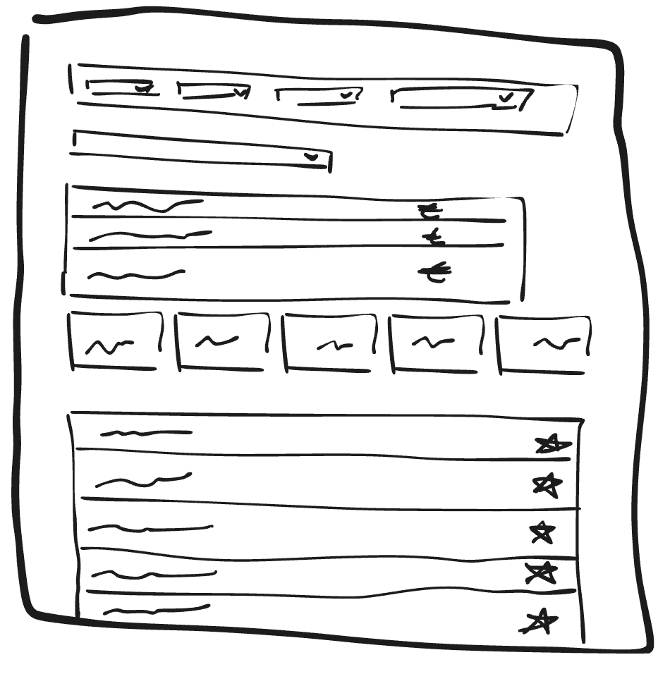

# Design Review

## Low-fidelity sketches

## List of taken considerations for sketches/design

1. **Clear navigation**: dropdown filters placed at the top.
2. **Information hierarchy**: sections are well separated (filters, list, cards, notes).
3. **Quick actions**: star icons on the right to mark or favorite items.

## Main problem we are solving for

The main problem is **information overload** in the interface.  
The goal is to **make data access clearer and faster**, especially in a dashboard or data management space.

## Measures of the success

Success is achieved when:

- The user can **find information or a tool in less than 3 clicks**.
- **Data is visually organized** in a clear and logical way (filters, groups).
- Users **don’t need help to understand the interface** (usability tests).

## List of visual aspects convictions

1. **Layout**: structured in rows and columns (filters, cards, lists).
2. **Spacing**: each section has enough breathing room to reduce clutter.
3. **Icons**: stars used to highlight important items or add to favorites.
4. **Visual consistency**: similar elements have the same size and shape (e.g., card previews).

## List of interaction patterns convictions

1. **Dropdown menus** for filtering: better than checkboxes when options are numerous.
2. **Clickable star icons**: a known and intuitive pattern, no explanation needed.
3. **Consistent alignment of actions** (e.g., all stars aligned to the right): improves scannability and user speed when interacting with lists.
